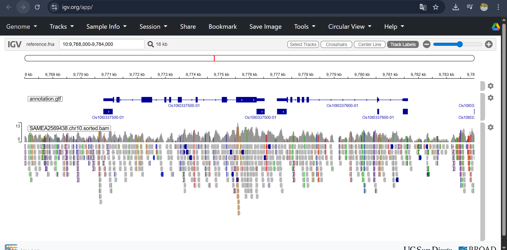

#Session_5_report
# This report is done by the students: Iness HIDOURI & Abdennacer KARA
##Exercice 1: Quality control
Using **FastQC**, we examined the sequencing quality of sample `SAMEA2569438`. 
* **1.1 Paired-end files:** Since the data is derived from **paired-end sequencing**, there are two files (`_1` and `_2`). The forward and reverse reads of the identical DNA fragments are contained in separate files.
* **1.2 Format:** The **FASTQ** format is used in the files. ID, Sequence, Separator (+), and Quality Scores are the four lines that make up each read.
* **1.3 Quality deop:** The "Per base sequence quality" figure in the FastQC report shows that, as is common with Illumina sequencing, the error rate tends to increase (quality declines) towards the **3' end** of the reads.
  **Attached evidence:**
* [FastQC Report - Read 1](results/SAMEA2569438.chr10_1_fastqc.html)
* [FastQC Report - Read 2](results/SAMEA2569438.chr10_2_fastqc.html)
##Exercice 2: Alignement file format
Using **BWA**, we mapped the reads to the *Oryza sativa* (Rice) reference genome (Chromosome 10).
* **2.1File size comparison:**  
  * **SAM:** The largest file (text based)
  * **BAM:** Binary compressed version of SAM. significantly smaller (approx 30% of SAM size)
  * **CRAM:** The smallest file. It uses references based compression, storing only the differences between the reads and reference genome.
##Exercice 3: Coverage analysis 
We calculated the depth of coverage using `samtools mpileup`.
* **3.1 Percentage of Chr10 with depth >100 :**
  * Total bases with depth  >100: **51,811** calculated using `awk`
  * Total length of Chromosome 10: **23,207,287 bp**
  * Calculation: Coverage percentage= (51.811 / 23,207,287)*100 =0.22% 
  * Interpretation of obtained results: only a small fraction of the chromosome has very high  coverage  (>100x) in this subset of data
##Exercice 4: Visualization
We visually examined our particular alignment results using the online **Integrative Genomics Viewer (IGV)**.
* **Setup:** We imported our local files into the [IGV Web App](https://igv.org/app):
    1.  **Reference:** *Oryza sativa* Chr10 (`reference.fna`).
    2.  **Annotation:** The gene structure file (`annotation.gtf`).
    3.  **Alignment:** Our sorted BAM file (`SAMEA2569438.chr10.sorted.bam`).
* **Observation:** The genomic region **10:9,768,000-9,784,000** was analyzed. We found a significant coverage of reads that specifically mapped to the **Os10g0337500** gene's exons. The correctness of the mapping in this area was confirmed by the alignment, which revealed discrete piles of reads that matched the gene structure given in the annotation track. To verify the workflow, we took a screenshot of this alignment.
**Visual validation:**

##Exercice 5: Variant calling and filtering
**Freebayes** (ploidy 2) was used to call variations, and **Bcftools** was used to filter them.
* **Filtering strategy:**To eliminate low-confidence variants, we used a hard filter, `QUAL < 1`.
* **Variant statistics after filtering:**
    * **SNPs:** 26820
    * **Indels:** 2286
##Problems faced: we have faced 3 major problems  the same we faced on the class: 
1- When we first started using Docker, we saw a "Permission denied" error. We fixed issue by using the host computer's `chmod 777` to modify the folder permissions.
2- Warnings about "IntelDeflater" not being supported were displayed by `Picard-tools`; nevertheless, the Java zip aligner was used instead, and the procedure was successfully finished.
3- Because the magnification level was too wide (whole chromosome), the first attempts to read the BAM file in IGV produced an empty track. We were able to clearly view the read alignments by entering the precise gene coordinates.

